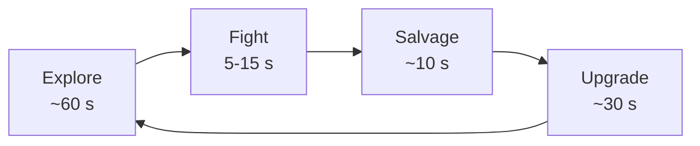

# Corked! — Game Design Document

| | |
|---|---|
| **Team** | [team name] |
| **Members & roles** | @name (design lead) · @name (tech lead) · @name (art lead) · @name (producer) … ( animal roles included here for IMT3603 )|
| **Engine / platform** | [e.g. Godot 4.7 / PC + Steam Deck] |
| **Repo** | [imt3603/](https://github.com/Svemeh/imt3603/) |
| **Doc version** | v0.1 |
| **Last updated** | YYYY-MM-DD |

## Changelog

> Newest first. One line per meaningful design change. Markers and returning teammates read this first

| Version | Date | Change | Who |
|---|---|---|---|
| v0.1 | YYYY-MM-DD | Initial page one | @name |

---

# 1. Page One — The Core

> sec.1 is mandatory, always current, and should fit on roughly one page. If sec.1 and the build disagree, one of them is
> wrong — fix one within the week.

## 1.1 Hook

A chaotic co-op game about making the perfect bottle of wine. Corked! is a friend-slop game where you and your friends run a small Italian vineyard together, turning grapes into bottled wine through a hands-on production process. Harvest, carry, stomp, press, bottle, and deliver while trying to keep the whole operation running. Everyone has something to do, everyone depends on someone else, and when one person falls behind, the whole vineyard starts falling apart. Making wine is the goal, but the real fun is the chaos you create together while trying to get there.

## 1.2 Design pillars

> Exactly three. Pillars are **decision filters, not slogans** — each comes with consequences (things it forbids or
> forces). Every feature in this document must serve at least one pillar or it gets cut, however cool it is.

| Pillar | What it means | Consequences (what it forbids/forces) |
|---|---|---|
| 1. The chain is only as strong as its weakest link | Every stage — pick, sort, press, ferment, bottle — is mandatory. Players repeatedly depend on each other, shared work creates chaos. One station stalling stalls the next part of the chain. Promotes teamplay | Avoids making any part of the game loop feel inconsequential |
| 2. One vienyard that grows / changes | The map is set in stone, you can upgrade and plant more on the farm but not expand the size or move to a new farm | Avoids content creep|
| 3. Intuitive mechanics | All mechanics should be simple enough and conveyed to the user in a way that makes it obvious what the course of action should be | Avoids steering the game in a direction where individual tasks take more focus than the whole picture|

## 1.3 Core loop

> Draw it (embed an image or a Mermaid diagram) and **time it**. If you cannot put timings on it, you have not designed
> it yet.

- **Moment loop (seconds):** …
- **Session loop (minutes):** … A meaningful session lasts **[N] minutes**.
- **Meta loop (hours):** …

## 1.4 Audience & genre

> Who plays this, what do they play now, what will they recognise, and what will surprise them? "Everyone" is not an
> audience. Name two or three comparison games and what you take from each and reject from each.

## 1.5 Look, feel, and tone — in one paragraph

> Mood, palette, one or two reference images. Full art direction lives in sec.9.

## 1.6 Scope: goals and non-goals

### Non-goals

> The most valuable sentences in a student GDD usually start with "No". Non-goals are decisions too — written down so
> they stay decided and do not get re-litigated every week. Move cut features here with a changelog note.

- No …
- No …
- No …

### MoSCoW scope table

> **Must** = the game is not this game without it (this is your vertical slice). **Should** = ships if the Musts land.
> **Could** = first against the wall when you are late. **Won't** = not this semester; belongs in non-goals.
> Every row needs an owner.

| Feature | Priority | Milestone | Owner | Status |
|---|---|---|---|---|
| [core mechanic] | Must | Vertical slice (wk N) | @name | not started |
| [second system] | Should | Full build (wk N) | @name | not started |
| [polish item] | Could | Final (wk N) | @name | not started |

---

# 2. Gameplay & Mechanics — owner: @name

> **Prose rules for every module:** numbers, units, and defaults ("fast" is an opinion; "6 m/s" is a decision — wrong
> numbers are fine, they are testable; missing numbers are not). One idea per paragraph, decision first, reason second.
> Diagrams over paragraphs for anything spatial or temporal. Pick one term per concept ("stamina" *or* "energy") and use
> it everywhere. "Etc." is a scope bug, not a word.

## 2.1 Player verbs & controls

| Verb | Input | Timing / numbers | Notes |
|---|---|---|---|
| Move | left stick / WASD | max 6 m/s, accel 0.2 s to max | |
| Jump | A / Space | height 2.2 m, coyote time 0.12 s | |

## 2.2 Systems & rules (the model of the world)

> This is the simulation your game runs on — the implicit and explicit rules, and how the pieces interact. One
> subsection per system, each stating: intent (which pillar it serves), the rules with numbers, the states and
> transitions (draw the state machine), and edge cases — especially *"what happens if the player just… doesn't?"*

### 2.2.x [System name]

- **Intent:** … (pillar N)
- **Rules:** …
- **Edge cases:** …

## 2.3 Movement & physics

> Gravity, friction, collision behaviour, anything non-standard. If you use engine defaults, say so — that is a decision.

## 2.4 Objects & interactions

> What objects exist, how the player interacts with each, and what state each carries. A table beats prose here.

## 2.5 Combat / conflict (if any)

> Frame data, damage tables, health values, death and failure consequences. Windups, active frames, recovery, i-frames —
> numbers a programmer can type in today and a playtester can falsify tomorrow.

## 2.6 Economy & resources (if any)

> What resources does the player have? How are they earned? How are they spent? Why do they want more? Add sources,
> sinks, and starting values.
>
> **If real money is involved at any point, see sec.12.4 — monetisation is now a regulated design surface in the EU/EEA.**

## 2.7 Progression & difficulty

> How does the player progress, and *how do they know* they are progressing? Challenge hierarchy, puzzle structure,
> unlock order, difficulty curve. Difficulty options are design — see sec.7.

## 2.8 Game options, saving, replay

> What options exist and how do they affect mechanics? Save model (save-anywhere / checkpoints / none — a decision, not
> an afterthought). Cheats and easter eggs if any.

---

# 3. Screen Flow & Game States — owner: @name

> A diagram of every screen and state (title, settings, pause, gameplay, game over…), the transitions between them, and
> one line on each screen's purpose. This diagram is usually the first thing the programmer builds.

---

# 4. Story, Setting & Characters — owner: @name

> Skip or minimise if your game is abstract — say so explicitly rather than leaving the section blank.

## 4.1 Narrative

> Backstory, plot beats, how story is delivered (cutscenes? barks? environmental?). Cutscene descriptions include
> actors, setting, and storyboard or script. How does narrative progression map to game progression?

## 4.2 World & areas

> Setting, aesthetics, and each area's physical character plus how it connects to the rest of the world.

## 4.3 Characters

> Per character: role, personality, appearance, abilities, animation needs (count them — this is an asset budget in
> disguise), and relationships.

---

# 5. Levels & Content Plan — owner: @name

> Per level: synopsis, objectives, how required knowledge is introduced, map sketch, critical path, key encounters.
> **Count the content**: levels × unique assets × mechanics introduced. This section is where scope hides.

## 5.1 Onboarding / training

> How does the player learn the game? (Pillar check: is your onboarding compatible with your session length?)

## 5.2 Level list

| Level | Synopsis | Introduces | Assets implied | Milestone |
|---|---|---|---|---|
| 1 | | | | Vertical slice |

---

# 6. Interface — owner: @name

## 6.1 Visual / HUD

> What is on the HUD and why does each element earn its pixels? Camera model (distance, FOV, behaviour on collision).
> Menus. Mock it up — a sketch beats 500 words.

## 6.2 Audio, music, sound effects

> Music direction and references; SFX list per verb and event (another hidden asset budget); mixing rules (what ducks
> what). How does audio support readability?

## 6.3 Help system

---

# 7. Controls & Accessibility — owner: @name

> Modern GDDs treat accessibility as design-time, not patch-time — it is far cheaper to build in than to retrofit, and
> in the EU/EEA the **European Accessibility Act** (applicable since June 2025) has pushed accessibility from
> "nice-to-have" to a compliance question for commercial digital products. State your targets so they get built and
> tested:

- Full input remapping: **yes/no**; hold-to-toggle alternatives: **yes/no**
- Colour is never the only information channel; palette checked for colour blindness: **yes/no**
- Subtitle size and contrast options; speaker names on dialogue: **yes/no**
- Screen-shake, camera-motion and flash toggles: **yes/no** (photosensitivity — no flashing above 3 Hz)
- Difficulty options framed as player choice (assist modes), not shame
- Text size minimum at target resolution: **[N] pt at 1080p**
- Reference: [Game Accessibility Guidelines](https://gameaccessibilityguidelines.com/) — pick your target tier and say
  which one.

---

# 8. Artificial Intelligence — owner: @name

## 8.1 Opponent / enemy AI

> Behaviour per enemy type (state machines, behaviour trees, or utility scoring — draw them). What makes each *readable*
> to the player? What does it do when it cannot reach the player?

## 8.2 Friendly / non-combat characters

## 8.3 Support AI

> Pathfinding approach, collision, perception model, spawning rules.

## 8.4 Generative AI *at runtime* (if any)

> Different question from sec.12.2. If a language model or generator runs **while the player plays** — dialogue, barks,
> level generation — this is a system with a latency budget, a failure mode, a cost, and a legal surface. State:
> local or hosted; the model and version; the per-request latency and token budget; what happens when it is slow, wrong,
> or offline; the guardrails against offensive or illegal output; and what the player is told. See
> [genai-and-provenance.md](genai-and-provenance.md).

---

# 9. Art Direction — owner: @name

> Style, palette, shape language, reference board (link). Key assets and how each is being made — modelled, bought,
> or generated, **with provenance** (see sec.12.2). Constraints that protect scope: camera distance, texture budget,
> animation reuse plan.

---

# 10. Technical — owner: @name

> Target hardware and minimum spec (include Steam Deck / handheld if relevant — it is the most common "low spec" target
> now). Engine and version, **pinned** (e.g. Godot 4.7.1, Unreal 5.8, Unity 6.3 LTS). Development toolchain. Data
> formats for designer-editable content. Network requirements (or "None — see non-goals"). Anything the design
> *requires* the tech to prove early — list it as a vertical-slice risk.

---

# 11. Playtesting Plan — owner: @name

> A GDD without a playtesting plan is a hypothesis without an experiment. See [play_test.md](play_test.md) for the
> assessed task and [../lectures/Playtesting.md](../lectures/notes/Playtesting.md) for method.

- **What we measure:** the timings and numbers claimed in sec.1.3 and sec.2 — the gap between claimed and observed is the
  tuning backlog.
- **Cadence:** [e.g. weekly from week N; first external test at vertical slice]
- **Methods:** observation notes, think-aloud, short survey — keep it light but written down.
- **Findings loop:** results are recorded as git issues, and each finding either changes this doc (changelog entry) or
  is explicitly rejected (with a reason).
- **Data & consent:** what you collect from testers, the consent wording, where it is stored, how long you keep it, and
  how someone withdraws. Recording screen, face, or voice is personal data under **GDPR** — say so here, and do not put
  raw recordings in a public repo. NTNU projects collecting personal data have institutional requirements; check before
  you record, not after.

---

# 12. Production Notes — owner: @name

## 12.1 Cultural material

> If the game draws on real cultures — including Sámi, other indigenous, or minority cultures — record here: what is
> referenced, who was consulted, what they said, and what changed as a result. Consultation is a dependency: budget time
> for it like any other. If you cannot do it properly, that is what non-goals are for.

## 12.2 AI use declaration

> Drafting is cheap; deciding is not. Declare what AI tools were used, for what (text, code, assets, audio, voice), and
> how outputs were reviewed. The standing test: **any team member can defend any section, out loud, without notice.**
>
> Watch for confident filler (fluent paragraphs that decide nothing), scope inflation, and unowned text — if nobody has
> argued about a section, it is not a decision yet.
>
> Full guidance, plus what a storefront will ask you at release: [genai-and-provenance.md](genai-and-provenance.md).

## 12.3 Document practice

- This file changes via merge requests; section owners review changes to their sections.
- Standing sprint agenda item: *where do the doc and the build disagree?* Fix one within the week.
- Stale text is deleted, not hoarded — git remembers.

## 12.4 Monetisation & compliance (if any real money is involved)

> Only fill this in if you have any purchase, currency, ad, or reward-randomisation mechanic. Then state: what is sold,
> the price shown in real currency alongside any virtual currency, whether any randomised reward exists and its
> disclosed odds, and whether minors are in the audience.
>
> This is live regulatory ground in the EU/EEA: PEGI now flags paid random items, the Commission's consumer-protection
> work targets dark patterns and in-game currency obfuscation, and a **Digital Fairness Act** proposal covering
> addictive design, loot boxes and dark patterns is expected during 2026. "We will figure out monetisation later" is a
> valid answer — write it in non-goals.

---

# 13. Competence Evidence — owner: each of you

> New for 2026, and the one section that is about *you* rather than the game.
>
> Each member lists the systems they own and the competences that ownership evidences, in "is able to" terms — the same
> vocabulary used by the [GameBadges](gamebadges.md) framework and by the individual component of
> [submission](../submission.md). Written up front, it also drives who reviews what.

| Member | Systems owned | "Is able to…" | Artefact (file, MR, build) |
|---|---|---|---|
| @name | Netcode, lobby | implement client-server state replication with interpolation | `net/replication.gd`, MR !42 |

---

# Appendix A — Reader's checklist (before you build from this doc)

- [ ] I can state the hook and pillars from memory
- [ ] I know which loop my task sits on
- [ ] I have the numbers I need (or have asked for them)
- [ ] I checked the changelog since I last read it
- [ ] Ambiguities are written down and assigned to an owner
- [ ] I know what is explicitly out of scope
- [ ] The answers to my questions went back into the doc

# Appendix B — Writer's checklist (before you commit)

- [ ] Could two readers build different things from this? (fix it)
- [ ] Every quantity has a number, a unit, and a default
- [ ] Each feature traces to a pillar and sits on a loop
- [ ] Spatial and temporal structure is drawn, not described
- [ ] The section has an owner and today's date
- [ ] Non-goals updated if scope moved
- [ ] Changelog entry written; stale text deleted

# Appendix C — Red flags (self-review)

A GDD is failing when: "fun/immersive/polished" appears where numbers should be · "etc./various/many" hides scope ·
there is no non-goals section · one author and no other committers · last updated five weeks ago · sections describe
features nobody is building this semester · the same fact appears twice with different values · you read a section and
cannot say what was decided.

---

*Lineage: descended from the classic [UNC/Taylor GDD outline](http://wwwx.cs.unc.edu/Courses/comp585-s11/585GameDesignDocumentTemplate.docx)
via the NTNU/VUW template (S. McCallum), restructured 2026 for lean/living practice: core-first, modular depth-on-demand,
owners, changelog, scope tables, playtesting, accessibility, cultural, AI-provenance and competence sections.*
